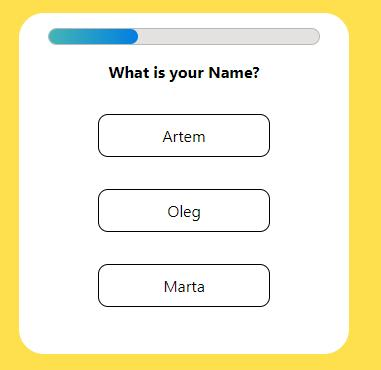
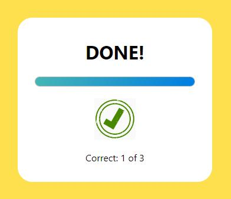

# Quiz training project

---

This is small React project just to test and improve my skills.
I created small object which contains questions, answers and correct answer ID.
Object length doesn't matter, applications will render as many questions as object contains.

```
const questions = [
  {
    question: 'How old are you?',
    answlist: ['20', '30', '40'],
    correct: 1,
  },
  {
    question: 'What is your Name?',
    answlist: ['Artem', 'Oleg', 'Marta'],
    correct: 2,
  },
  {
    question: 'Where did you study?',
    answlist: ['LAG', 'NULP', 'SW45'],
    correct: 0,
  },
];
```

Application contains App, start and finish components.

Start component will render questions, answers, progression line.



Finish component will render result.


